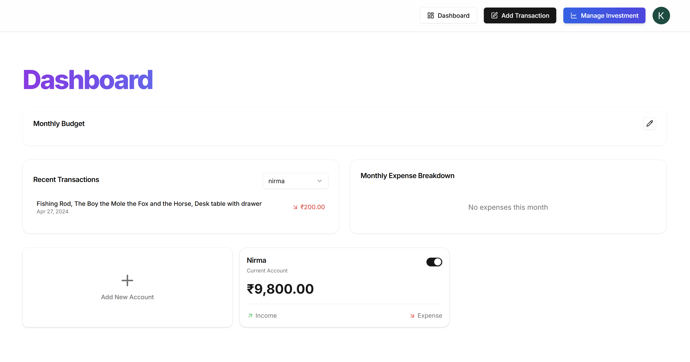
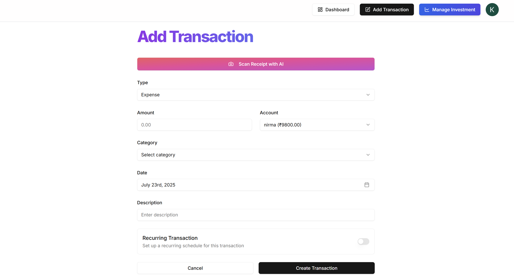
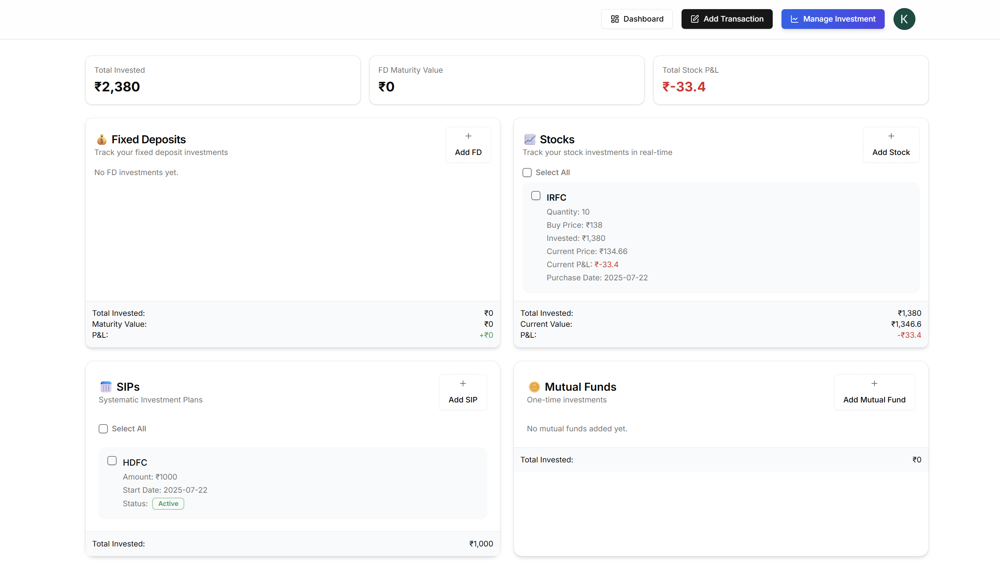

# 💰 FinVista — Smart Personal Finance & Investment Tracker

> A modern and intuitive application to monitor, manage, and optimize your personal finances and investments.

---

## 🚀 Key Features

📂 **Manage Investments**
- Easily add and manage Fixed Deposits, Mutual Funds, SIPs, and Stocks.
- View summaries like total investment, maturity amount, and profits at a glance.
- Card-based layout with sticky summary bars for quick tracking.

💳 **Track Expenses**
- Record categorized transactions with ease.
- Attach receipts and auto-fill entries using **Gemini AI**.

📉 **Real-Time Stock Updates**
- Stay updated with live prices via Yahoo Finance.

📬 **Smart Notifications**
- Get monthly insights and budget alerts using **Inngest**.

🗃️ **Bulk Investment Operations**
- Select and manage multiple entries in one go.

📱 **Mobile-Ready & Accessible**
- Fully responsive UI with accessible design components.

🔐 **Secure by Design**
- Built-in security and bot protection powered by **Arcjet**.

---

## ⚙️ Tech Stack

| Layer         | Technology Used                           |
|---------------|--------------------------------------------|
| Frontend      | Next.js (App Router), React, Tailwind CSS |
| UI Components | shadcn/ui, Lucide                         |
| Backend       | Next.js API Routes with Server Actions    |
| Database      | PostgreSQL using Prisma ORM               |
| Authentication| Clerk                                      |
| AI Integration| Gemini AI                                  |
| Finance API   | Yahoo Finance                              |
| Emails & Alerts | Inngest                                  |
| Security      | Arcjet                                     |

---

## 🖼️ Screenshots

| Dashboard | Transaction | Investment |
|-----------|------------|-------------|
|  |  |  |

---

## 🛠️ Getting Started

```bash
# Step 1: Clone the repository
git clone https://github.com/your-username/finvista.git
cd finvista

# Step 2: Install dependencies
npm install

# Step 3: Configure environment variables
cp .env.example .env.local
# Fill in your database credentials, Clerk keys, and API keys

# Step 4: Run the development server
npm run dev
